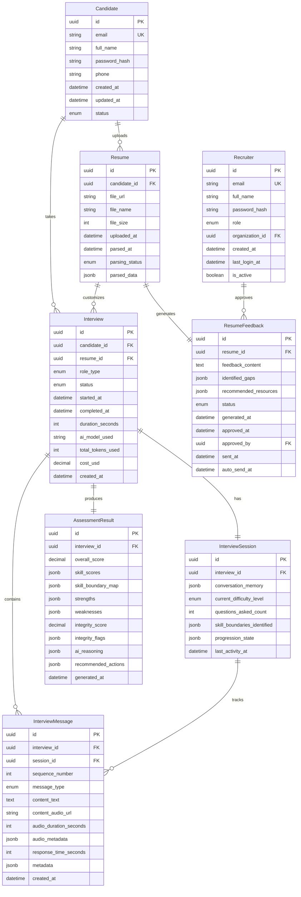

<!-- Updated: 2025-11-05 - Added Epic 03 JobPosting and Application data models -->

# Data Models

## Candidate

**Purpose:** Represents a job seeker going through the assessment process

**Key Attributes:**
- `id`: UUID - Unique identifier
- `email`: String - Primary contact and login credential (unique)
- `full_name`: String - Candidate's name
- `password_hash`: String - Bcrypt hashed password
- `phone`: String (optional) - Contact number
- `created_at`: DateTime - Account creation timestamp
- `updated_at`: DateTime - Last modification timestamp
- `status`: Enum - `active`, `inactive`, `deleted`

**Relationships:**
- Has many `Resume` records (candidate may upload multiple versions)
- Has many `Interview` records (one candidate can have multiple interviews)

---

## Resume

**Purpose:** Stores uploaded resumes and AI-extracted skill data

**Key Attributes:**
- `id`: UUID - Unique identifier
- `candidate_id`: UUID - Foreign key to Candidate
- `file_url`: String - Storage location (Supabase Storage or S3)
- `file_name`: String - Original filename
- `file_size`: Integer - Size in bytes
- `uploaded_at`: DateTime - Upload timestamp
- `parsed_at`: DateTime (nullable) - When AI parsing completed
- `parsing_status`: Enum - `pending`, `processing`, `completed`, `failed`
- `parsed_data`: JSONB - AI-extracted skills, experience, technologies
  ```json
  {
    "skills": ["React", "TypeScript", "Node.js"],
    "experience_years": 3,
    "education": "BS Computer Science",
    "previous_roles": ["Frontend Developer", "Full-Stack Engineer"],
    "technical_domains": {"frontend": "advanced", "backend": "intermediate"}
  }
  ```

**Relationships:**
- Belongs to one `Candidate`
- Has one `ResumeFeedback` (optional - may not have feedback generated yet)
- Has many `Interview` records (interviews customized from this resume)

---

## ResumeFeedback

**Purpose:** Manages AI-generated feedback workflow and recruiter approval

**Key Attributes:**
- `id`: UUID - Unique identifier
- `resume_id`: UUID - Foreign key to Resume (one-to-one)
- `feedback_content`: Text - AI-generated feedback email body
- `identified_gaps`: JSONB - Specific improvement areas
- `recommended_resources`: JSONB - Learning suggestions
- `status`: Enum - `draft`, `pending_approval`, `approved`, `sent`
- `generated_at`: DateTime - When AI created feedback
- `approved_at`: DateTime (nullable) - When recruiter approved
- `approved_by`: UUID (nullable) - Recruiter who approved
- `sent_at`: DateTime (nullable) - When email was sent to candidate
- `auto_send_at`: DateTime (nullable) - Scheduled auto-send time if not manually approved

**Relationships:**
- Belongs to one `Resume` (one-to-one)
- References one `Recruiter` (approved_by)

---

## Interview

**Purpose:** Represents a complete interview assessment session

**Key Attributes:**
- `id`: UUID - Unique identifier
- `candidate_id`: UUID - Foreign key to Candidate
- `resume_id`: UUID (nullable) - Resume used for customization
- `role_type`: Enum - `react`, `python`, `javascript`, `fullstack`
- `status`: Enum - `scheduled`, `in_progress`, `completed`, `abandoned`
- `started_at`: DateTime (nullable) - When interview began
- `completed_at`: DateTime (nullable) - When interview finished
- `duration_seconds`: Integer (nullable) - Total interview duration
- `ai_model_used`: String - e.g., "gpt-4o-mini" or "gpt-4"
- `total_tokens_used`: Integer - LangChain token count
- `cost_usd`: Decimal - Calculated cost for this interview
- `created_at`: DateTime - Interview scheduled/created timestamp

**Relationships:**
- Belongs to one `Candidate`
- Belongs to one `Resume` (optional - may be scheduled without resume)
- Has one `InterviewSession` (conversation state and memory)
- Has many `InterviewMessage` records (conversation history)
- Has one `AssessmentResult` (scoring and analysis)

---

## InterviewSession

**Purpose:** Manages LangChain conversation state and progressive assessment tracking

**Key Attributes:**
- `id`: UUID - Unique identifier
- `interview_id`: UUID - Foreign key to Interview (one-to-one)
- `conversation_memory`: JSONB - LangChain memory state (messages, context)
- `current_difficulty_level`: Enum - `warmup`, `standard`, `advanced`
- `questions_asked_count`: Integer - Number of questions asked so far
- `skill_boundaries_identified`: JSONB - Map of skill → proficiency level
  ```json
  {
    "react_hooks": "proficient",
    "state_management": "intermediate",
    "performance_optimization": "boundary_reached"
  }
  ```
- `progression_state`: JSONB - Internal state for progressive assessment algorithm
- `last_activity_at`: DateTime - For detecting abandoned sessions

**Relationships:**
- Belongs to one `Interview` (one-to-one)
- Has many `InterviewMessage` records

---

## InterviewMessage

**Purpose:** Stores each question-answer exchange in the interview conversation

**Key Attributes:**
- `id`: UUID - Unique identifier
- `interview_id`: UUID - Foreign key to Interview
- `session_id`: UUID - Foreign key to InterviewSession
- `sequence_number`: Integer - Order in conversation (1, 2, 3...)
- `message_type`: Enum - `ai_question`, `candidate_response`
- `content_text`: Text - The actual text (question or answer)
- `content_audio_url`: String (nullable) - Audio file URL if speech-based
- `audio_duration_seconds`: Integer (nullable) - Audio length
- `audio_metadata`: JSONB (nullable) - Audio technical details for debugging
  ```json
  {
    "sample_rate": 16000,
    "codec": "opus",
    "file_size_bytes": 45231,
    "whisper_processing_time_ms": 850,
    "confidence_score": 0.94
  }
  ```
- `response_time_seconds`: Integer (nullable) - Time from question to response start
- `metadata`: JSONB - Additional data (hesitation markers, speech patterns, etc.)
- `created_at`: DateTime - Message timestamp

**Relationships:**
- Belongs to one `Interview`
- Belongs to one `InterviewSession`

---

## AssessmentResult

**Purpose:** Stores AI-generated scoring, skill maps, and integrity analysis

**Key Attributes:**
- `id`: UUID - Unique identifier
- `interview_id`: UUID - Foreign key to Interview (one-to-one)
- `overall_score`: Decimal - Overall competency score (0-100)
- `skill_scores`: JSONB - Detailed scores per technical area
  ```json
  {
    "react_fundamentals": 85,
    "state_management": 72,
    "hooks_patterns": 88,
    "performance": 45
  }
  ```
- `skill_boundary_map`: JSONB - Visualization data for skill proficiency
- `strengths`: JSONB - Array of identified strengths with evidence
- `weaknesses`: JSONB - Array of improvement areas with evidence
- `integrity_score`: Decimal - Overall integrity rating (0-100)
- `integrity_flags`: JSONB - Specific red flags with severity and evidence
  ```json
  [
    {
      "type": "response_timing_anomaly",
      "severity": "medium",
      "evidence": "Answered complex algorithm question in 8 seconds",
      "confidence": 0.75
    }
  ]
  ```
- `ai_reasoning`: JSONB - AI's explanation for scores and decisions
- `recommended_actions`: JSONB - Suggestions for recruiter
- `generated_at`: DateTime - When assessment was completed

**Relationships:**
- Belongs to one `Interview` (one-to-one)

---

## Recruiter

**Purpose:** Represents recruitment firm staff managing candidates

**Key Attributes:**
- `id`: UUID - Unique identifier
- `email`: String - Login credential (unique)
- `full_name`: String - Recruiter's name
- `password_hash`: String - Bcrypt hashed password
- `role`: Enum - `recruiter`, `admin`, `viewer`
- `organization_id`: UUID (nullable) - Future multi-tenant support
- `created_at`: DateTime
- `last_login_at`: DateTime (nullable)
- `is_active`: Boolean - Can be deactivated without deletion

**Relationships:**
- Can approve `ResumeFeedback` records (via `approved_by`)
- Future: Has many `Interview` records through assignment

---

## IntegrationWebhook (Future - Epic 5)

**Purpose:** Manages external ATS/HRIS webhook configurations

**Key Attributes:**
- `id`: UUID
- `organization_id`: UUID
- `webhook_url`: String - External system endpoint
- `webhook_secret`: String - For signature verification
- `event_types`: JSONB - Which events to send (interview_complete, etc.)
- `is_active`: Boolean
- `last_triggered_at`: DateTime (nullable)
- `created_at`: DateTime

**Note:** Deferred to Epic 5 - ATS Integration phase

---

## JobPosting (Epic 03)

**Purpose:** Represents a job opening from a hiring company

**Key Attributes:**
- `id`: UUID - Unique identifier
- `title`: String - Job title (e.g., "Senior React Developer")
- `company`: String - Hiring company name
- `description`: Text - Full job description
- `role_category`: Enum - Job function (`engineering`, `quality_assurance`, `data`, `devops`, `design`, `product`, `sales`, `support`, `operations`, `management`, `other`)
- `tech_stack`: String (nullable) - Primary technology (e.g., 'React', 'Python', 'TypeScript', 'Playwright')
- `employment_type`: Enum - `permanent`, `contract`, `part_time`
- `work_setup`: Enum - `remote`, `hybrid`, `onsite`
- `location`: String - Job location (e.g., "Sydney, AU" or "Remote")
- `salary_min`, `salary_max`: Numeric - Salary range
- `salary_currency`: String - Currency code (default: 'AUD')
- `required_skills`: JSONB - Array of required skills
  ```json
  ["React", "TypeScript", "REST APIs", "Git", "Agile"]
  ```
- `experience_level`: String - e.g., "Junior", "Mid-level", "Senior"
- `status`: Enum - `active`, `paused`, `closed` (default: 'active')
- `is_cancelled`: Boolean - Whether job was cancelled
- `cancellation_reason`: Text (nullable) - Reason for cancellation
- `created_at`, `updated_at`: DateTime - Timestamps

**Relationships:**
- Has many `Application` records (candidates applying to this job)
- Has many `Interview` records (via applications)

**Business Logic:**
- `tech_stack` drives AI interview customization (e.g., 'React' → React-focused questions)
- `role_category` used for filtering and categorization
- `status='active'` means accepting applications
- When job cancelled, `is_cancelled=true` and existing applications preserved but interview creation blocked

---

## Application (Epic 03)

**Purpose:** Represents a candidate's application to a specific job posting

**Key Attributes:**
- `id`: UUID - Unique identifier
- `candidate_id`: UUID - Foreign key to candidates table
- `job_posting_id`: UUID - Foreign key to job_postings table
- `interview_id`: UUID (nullable) - Foreign key to interviews table (set after interview created)
- `status`: Enum - `applied`, `interview_scheduled`, `interview_completed`, `under_review`, `rejected`, `offered`, `accepted`, `withdrawn`
- `applied_at`: DateTime - Application submission timestamp
- `created_at`, `updated_at`: DateTime - Record timestamps

**Relationships:**
- Belongs to `Candidate` (applicant)
- Belongs to `JobPosting` (job being applied to)
- Belongs to `Interview` (optional, created after application)

**Constraints:**
- Unique constraint on `(candidate_id, job_posting_id)` - prevents duplicate applications to same job

**Business Logic:**
- Upon creation, triggers AI interview creation automatically (linked via `interview_id`)
- Interview's `role_type` derived from job posting's `tech_stack`
- Status progresses: `applied` → `interview_scheduled` → `interview_completed` → `under_review`/`rejected`/`offered`
- Candidate can only apply once to each job posting (enforced by unique constraint)
- If candidate withdraws, status set to `withdrawn` but record preserved for analytics

---

## Data Model Diagram



---

## Key Design Decisions

**1. Separate ResumeFeedback Table**
- ✅ Clean separation of concerns: Resume = storage, Feedback = workflow
- ✅ Enables feedback iteration history (recruiter edits, multiple versions)
- ✅ Clear approval workflow tracking
- ✅ Easier to query "pending approvals" for recruiter dashboard

**2. Audio Metadata in InterviewMessage**
- ✅ Debug speech processing issues (codec problems, quality degradation)
- ✅ Track Whisper API performance (processing time trends)
- ✅ Confidence scores help identify unreliable transcriptions
- ✅ Sample rate validation ensures quality standards

**3. JSONB for AI-Generated Data**
- ✅ Flexible schema for evolving AI outputs (scores, reasoning, flags)
- ✅ PostgreSQL's JSONB supports indexing and queries: `WHERE parsed_data->>'skills' @> '["React"]'`
- ✅ No schema migrations needed when AI output format changes
- ⚠️ Trade-off: Less type safety, but necessary for AI flexibility

**4. Separate InterviewSession from Interview**
- ✅ Clean separation: Interview = metadata, Session = conversation state
- ✅ LangChain memory isolated for independent management
- ✅ Enables session resumption and state snapshots
- ✅ Progressive assessment state doesn't clutter main Interview table

**5. One-to-One AssessmentResult**
- ✅ Separates "interview conduct" from "scoring/analysis"
- ✅ Allows regenerating scores without affecting interview record
- ✅ Clean boundary for future async scoring service extraction

**6. UUID Primary Keys**
- ✅ Distributed-friendly (no ID collisions when scaling)
- ✅ Non-sequential = harder to enumerate candidates (security)
- ✅ Works seamlessly with Supabase and future microservices

**7. Deferred Audit Logging**
- ✅ Focus on core functionality for MVP
- 🔄 Add comprehensive audit trails in production phase when GDPR compliance critical

---

