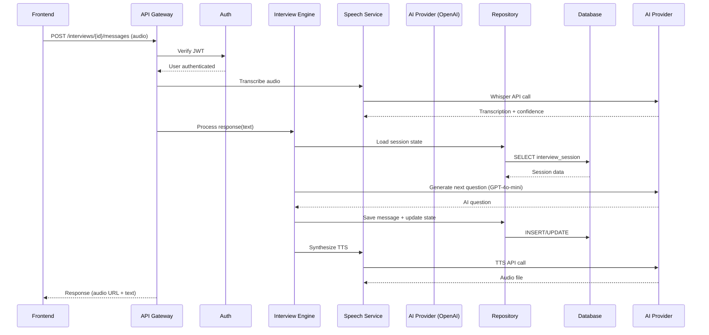

# Components

## Auth Service

**Responsibility:** Handle candidate and recruiter authentication, authorization, and session management

**Key Interfaces:**
- `register_candidate(email, password, full_name) → Candidate`
- `login_candidate(email, password) → JWT token`
- `register_recruiter(email, password, full_name, role) → Recruiter`
- `login_recruiter(email, password) → JWT token`
- `verify_token(token) → User ID + Role`
- `refresh_token(token) → New JWT token`

**Dependencies:**
- `CandidateRepository` - Database access for candidates
- `RecruiterRepository` - Database access for recruiters
- `passlib` - Password hashing (bcrypt)
- `PyJWT` - Token generation and validation

**Technology Stack:**
- FastAPI dependency injection for auth middleware
- JWT with 24-hour expiration (configurable)
- Bcrypt with cost factor 12 for password hashing
- Rate limiting via SlowAPI (5 failed attempts = 15 min lockout)

**Security Considerations:**
- Passwords never stored in plaintext
- Tokens signed with secret key from environment
- HTTPS-only token transmission (enforced in production)

---

## AI Interview Engine

**Responsibility:** Orchestrate conversational AI interviews with progressive difficulty adjustment and real-time skill boundary detection

**Key Interfaces:**
- `start_interview(candidate_id, resume_id, role_type) → Interview`
- `process_candidate_response(interview_id, response_text) → AI question`
- `get_next_question(session_id) → Question + metadata`
- `detect_skill_boundary(session_id, skill_area) → Proficiency level`
- `complete_interview(interview_id) → Assessment trigger`

**Dependencies:**
- `InterviewRepository` - Interview persistence
- `InterviewSessionRepository` - Conversation state management
- `InterviewMessageRepository` - Message history
- `OpenAIProvider` (via abstraction) - LLM access
- `LangChain` - Conversation memory and prompt management

**Technology Stack:**
- LangChain `ConversationBufferMemory` for context retention
- Custom `ProgressiveAssessmentEngine` class for difficulty logic
- Prompt templates versioned in `backend/prompts/` directory
- Token counting for cost tracking
- Async processing for concurrent sessions

**Progressive Assessment Algorithm:**
1. **Warmup Phase (2-3 questions):** Confidence-building, basic concepts
2. **Standard Phase (5-8 questions):** Core competency evaluation
3. **Advanced Phase (3-5 questions):** Boundary exploration until struggles detected
4. **Adaptive Branching:** AI adjusts based on response quality

**Internal Structure:**
```python
class AIInterviewEngine:
    def __init__(self, ai_provider: AIProvider, session_repo: SessionRepository):
        self.ai_provider = ai_provider
        self.session_repo = session_repo
        self.prompt_manager = PromptTemplateManager()
    
    async def process_response(self, interview_id: UUID, response: str) -> Question:
        # Load session state
        # Analyze response quality
        # Update skill boundaries
        # Determine next difficulty level
        # Generate contextual question
        # Save state
```

---

## Speech Processing Service

**Responsibility:** Handle audio transcription (STT) and voice synthesis (TTS) with provider abstraction

**Key Interfaces:**
- `transcribe_audio(audio_file, metadata) → Transcription + confidence`
- `synthesize_speech(text, voice_config) → Audio URL`
- `validate_audio_quality(audio_metadata) → Quality score`
- `process_audio_stream(stream_chunks) → Real-time text`

**Dependencies:**
- `OpenAIProvider` - Whisper API for STT, TTS API for voice
- `InterviewMessageRepository` - Store audio metadata
- Supabase Storage or S3 - Audio file storage
- `httpx` - Async HTTP client for OpenAI API

**Technology Stack:**
- OpenAI Whisper API (primary for MVP)
- OpenAI TTS API with `alloy` voice (neural)
- Audio format support: WebM, Opus, MP3, WAV
- Target sample rate: 16kHz minimum
- Backend audio processing (never expose API keys to frontend)

**Provider Abstraction:**
```python
class SpeechProvider(ABC):
    @abstractmethod
    async def transcribe(self, audio_data: bytes) -> TranscriptionResult:
        pass
    
    @abstractmethod
    async def synthesize(self, text: str) -> bytes:
        pass

class OpenAISpeechProvider(SpeechProvider):
    # OpenAI Whisper + TTS implementation

# Future: AzureSpeechProvider, GCPSpeechProvider
```

**Audio Metadata Capture:**
- Sample rate, codec, file size
- Whisper processing time
- Confidence scores per segment
- Background noise levels (future)

---

## Resume Parser Service

**Responsibility:** Parse uploaded resumes, extract skills/experience, generate feedback

**Key Interfaces:**
- `upload_resume(candidate_id, file) → Resume`
- `parse_resume_async(resume_id) → Background task`
- `extract_skills(resume_text) → Parsed data`
- `generate_feedback(parsed_data) → ResumeFeedback`
- `approve_feedback(feedback_id, recruiter_id) → Send email`

**Dependencies:**
- `ResumeRepository` - Resume persistence
- `ResumeFeedbackRepository` - Feedback workflow
- `OpenAIProvider` - GPT-4o-mini for parsing/feedback
- Supabase Storage - File storage
- `FastAPI BackgroundTasks` - Async processing
- Email service (SendGrid/AWS SES - future)

**Technology Stack:**
- PDF parsing: `PyPDF2` or `pdfplumber`
- DOCX parsing: `python-docx`
- AI extraction: GPT-4o-mini with structured output
- Background processing: FastAPI BackgroundTasks (MVP)
- Processing SLA: 24 hours per NFR15

**Parsing Pipeline:**
1. **Upload:** Store file in Supabase Storage
2. **Extract Text:** PDF/DOCX → plain text
3. **AI Analysis:** GPT-4o-mini extracts structured data
4. **Feedback Generation:** AI creates improvement suggestions
5. **Recruiter Approval:** Optional manual review before sending
6. **Auto-send:** After 4 hours if not manually reviewed

---

## Assessment Scoring Service

**Responsibility:** Generate comprehensive scoring, skill maps, and integrity analysis post-interview

**Key Interfaces:**
- `generate_assessment(interview_id) → AssessmentResult`
- `calculate_skill_scores(messages, session_state) → Skill map`
- `analyze_integrity(messages, timing_data) → Integrity flags`
- `generate_ai_reasoning(scores, evidence) → Explanations`
- `recommend_actions(assessment) → Recruiter suggestions`

**Dependencies:**
- `InterviewRepository` - Interview data
- `InterviewMessageRepository` - Conversation history
- `AssessmentResultRepository` - Results storage
- `OpenAIProvider` - GPT-4o-mini for analysis
- `LangChain` - Structured output parsing

**Technology Stack:**
- Post-interview async processing
- Multi-pass analysis: technical → integrity → recommendations
- Structured output via Pydantic models
- Caching intermediate results in session state

**Scoring Components:**

**1. Technical Scoring:**
- Parse conversation for technical concepts demonstrated
- Map responses to skill proficiency levels
- Generate evidence-backed skill scores (0-100)

**2. Integrity Analysis:**
- Response timing anomalies (too fast = suspicious)
- Pattern matching against known solutions (future: vector similarity)
- Hesitation detection from audio metadata
- Consistency checking across responses

**3. AI Reasoning Generation:**
- For each score, AI explains its rationale
- Cites specific questions/answers as evidence
- Provides confidence levels

---

## API Gateway Layer

**Responsibility:** Single entry point for all HTTP requests with middleware pipeline

**Key Components:**
- FastAPI routers for endpoint organization
- Authentication middleware (JWT validation)
- Rate limiting middleware (SlowAPI)
- CORS configuration
- Request/response logging
- Error handling and standardization

**Router Structure:**
```
/api/v1/
├── /auth/          → Auth Service
├── /candidates/    → Candidate operations
├── /resumes/       → Resume upload/feedback
├── /interviews/    → Interview management
├── /messages/      → Interview messaging
├── /assessments/   → Results retrieval
├── /recruiters/    → Recruiter portal
└── /webhooks/      → External integrations (Epic 5)
```

**Middleware Pipeline:**
1. **CORS** - Frontend origin whitelisting
2. **Rate Limiting** - Per-endpoint limits
3. **Authentication** - JWT validation (protected routes)
4. **Request Logging** - Structured logs with correlation IDs
5. **Error Handling** - Standardized error responses
6. **Response Compression** - Gzip for large payloads

---

## Repository Layer

**Responsibility:** Abstract database access with clean interfaces for all entities

**Repositories:**
- `CandidateRepository`
- `RecruiterRepository`
- `ResumeRepository`
- `ResumeFeedbackRepository`
- `InterviewRepository`
- `InterviewSessionRepository`
- `InterviewMessageRepository`
- `AssessmentResultRepository`

**Standard Interface Pattern:**
```python
class BaseRepository(ABC, Generic[T]):
    @abstractmethod
    async def create(self, entity: T) -> T:
        pass
    
    @abstractmethod
    async def get_by_id(self, id: UUID) -> Optional[T]:
        pass
    
    @abstractmethod
    async def update(self, entity: T) -> T:
        pass
    
    @abstractmethod
    async def delete(self, id: UUID) -> bool:
        pass
```

**Technology Stack:**
- SQLAlchemy 2.0 async ORM
- asyncpg driver for PostgreSQL
- Transaction management via context managers
- Connection pooling (10 connections for MVP)

---

## Component Interaction Diagram



---

