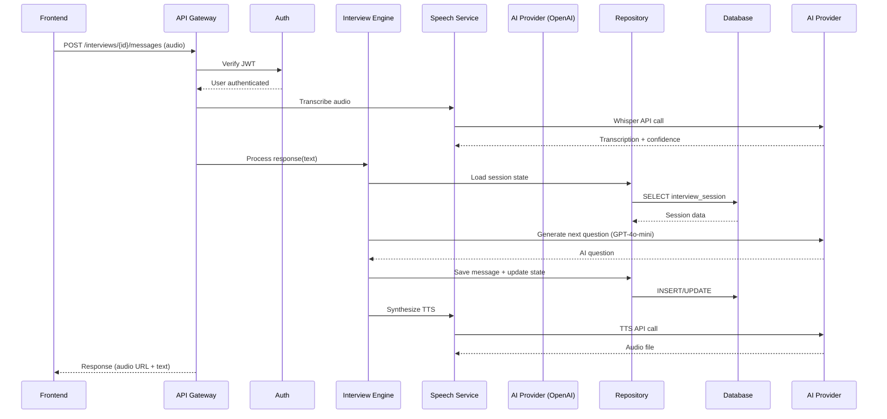

# Components

## Auth Service

**Responsibility:** Handle candidate and recruiter authentication, authorization, and session management

**Key Interfaces:**
- `register_candidate(email, password, full_name) → Candidate`
- `login_candidate(email, password) → JWT token`
- `register_recruiter(email, password, full_name, role) → Recruiter`
- `login_recruiter(email, password) → JWT token`
- `verify_token(token) → User ID + Role`
- `refresh_token(token) → New JWT token`

**Dependencies:**
- `CandidateRepository` - Database access for candidates
- `RecruiterRepository` - Database access for recruiters
- `passlib` - Password hashing (bcrypt)
- `PyJWT` - Token generation and validation

**Technology Stack:**
- FastAPI dependency injection for auth middleware
- JWT with 24-hour expiration (configurable)
- Bcrypt with cost factor 12 for password hashing
- Rate limiting via SlowAPI (5 failed attempts = 15 min lockout)

**Security Considerations:**
- Passwords never stored in plaintext
- Tokens signed with secret key from environment
- HTTPS-only token transmission (enforced in production)

---

## AI Interview Engine

**Responsibility:** Orchestrate conversational AI interviews with progressive difficulty adjustment and real-time skill boundary detection

**Key Interfaces:**
- `start_interview(candidate_id, resume_id, role_type) → Interview`
- `process_candidate_response(interview_id, response_text) → AI question`
- `get_next_question(session_id) → Question + metadata`
- `detect_skill_boundary(session_id, skill_area) → Proficiency level`
- `complete_interview(interview_id) → Assessment trigger`

**Dependencies:**
- `InterviewRepository` - Interview persistence
- `InterviewSessionRepository` - Conversation state management
- `InterviewMessageRepository` - Message history
- `OpenAIProvider` (via abstraction) - LLM access
- `LangChain` - Conversation memory and prompt management

**Technology Stack:**
- LangChain `ConversationBufferMemory` for context retention
- Custom `ProgressiveAssessmentEngine` class for difficulty logic
- Prompt templates versioned in `backend/prompts/` directory
- Token counting for cost tracking
- Async processing for concurrent sessions

**Progressive Assessment Algorithm:**
1. **Warmup Phase (2-3 questions):** Confidence-building, basic concepts
2. **Standard Phase (5-8 questions):** Core competency evaluation
3. **Advanced Phase (3-5 questions):** Boundary exploration until struggles detected
4. **Adaptive Branching:** AI adjusts based on response quality

**Internal Structure:**
```python
class AIInterviewEngine:
    def __init__(self, ai_provider: AIProvider, session_repo: SessionRepository):
        self.ai_provider = ai_provider
        self.session_repo = session_repo
        self.prompt_manager = PromptTemplateManager()
    
    async def process_response(self, interview_id: UUID, response: str) -> Question:
        # Load session state
        # Analyze response quality
        # Update skill boundaries
        # Determine next difficulty level
        # Generate contextual question
        # Save state
```

---

## Speech Processing Service

**Responsibility:** Handle audio transcription (STT) and voice synthesis (TTS) with provider abstraction

**Implementation Status:** ✅ **Completed in Story 1.5.1** (November 2025)

**Key Interfaces:**
- `transcribe_candidate_audio(audio_data: bytes, interview_id: UUID) → TranscriptionResult`
- `generate_ai_speech(text: str, interview_id: UUID) → bytes`
- `store_audio_metadata(interview_id: UUID, message_id: UUID, metadata: dict)`
- `validate_audio_quality(audio_metadata: dict) → bool`

**Dependencies:**
- `OpenAISpeechProvider` - Whisper API for STT, TTS API for voice synthesis
- `InterviewMessageRepository` - Store audio metadata in `audio_metadata` JSONB field
- `SpeechCostCalculator` - Track STT/TTS costs per interview
- `httpx.AsyncClient` - Async HTTP client for OpenAI API calls

**Technology Stack:**
- **OpenAI Whisper API** (primary STT for MVP)
  - Model: `whisper-1`
  - Response format: `verbose_json` for confidence scores
  - Language: `en` (English only for MVP)
  - Audio formats: WAV, MP3, WebM, Opus
  - Cost: $0.006/minute
- **OpenAI TTS API** (primary voice synthesis for MVP)
  - Model: `tts-1` (faster, sufficient quality)
  - Voice: `alloy` (neutral, professional tone)
  - Speed: 1.0 (natural pace)
  - Output: MP3 audio
  - Cost: $0.015/1K characters
- **Backend audio processing** (API keys never exposed to frontend)
- **Target sample rate:** 16kHz minimum
- **Max file size:** 25MB (Whisper API limit)

**Provider Abstraction Layer:**
```python
# backend/app/providers/speech_provider.py
class SpeechProvider(ABC):
    """Abstract interface for speech services (STT + TTS)"""
    
    @abstractmethod
    async def transcribe_audio(self, audio_data: bytes, language: str = "en") -> TranscriptionResult:
        """Transcribe audio to text with confidence scores"""
        pass
    
    @abstractmethod
    async def synthesize_speech(self, text: str, voice: str = "alloy", speed: float = 1.0) -> bytes:
        """Generate speech audio from text"""
        pass
    
    @abstractmethod
    def get_supported_audio_formats(self) -> list[str]:
        """Return supported audio MIME types"""
        pass
    
    @abstractmethod
    def validate_audio_quality(self, audio_metadata: dict) -> bool:
        """Validate audio meets quality standards"""
        pass

# backend/app/providers/openai_speech_provider.py
class OpenAISpeechProvider(SpeechProvider):
    """OpenAI implementation for Whisper (STT) and TTS"""
    # Full implementation with retry logic, error handling, cost tracking

# Future providers: AzureSpeechProvider, GCPSpeechProvider
```

**Audio Metadata Storage:**
```json
// Stored in interview_messages.audio_metadata JSONB field
{
  "provider": "openai",
  "model": "whisper-1",
  "confidence": 0.95,
  "sample_rate_hz": 16000,
  "format": "audio/webm",
  "file_size_bytes": 125000,
  "processing_time_ms": 1200,
  "language": "en",
  "segments": [
    {
      "text": "segment text",
      "start": 0.0,
      "end": 2.5,
      "confidence": 0.93
    }
  ]
}
```

**Cost Tracking:**
- **Database fields added:** `interviews.speech_tokens_used` (int), `interviews.speech_cost_usd` (Decimal)
- **Cost calculation:** Automatic via `SpeechCostCalculator` utility
- **Per-interview tracking:** Total speech cost separate from AI cost
- **Breakdown:** STT cost + TTS cost tracked independently

**Error Handling & Retry Logic:**
- **429 (Rate Limit):** Exponential backoff (1s, 2s, 4s), max 3 retries
- **500 (Server Error):** Retry with 2s delay, max 3 attempts
- **408 (Timeout):** Retry once with 5s delay
- **400 (Bad Request):** No retry, raise `AudioValidationError` immediately
- **401 (Auth Error):** No retry, raise `SpeechProviderError` immediately
- **Timeouts:** 30s for Whisper, 15s for TTS
- **Logging:** All API errors logged with correlation IDs

**Service Orchestration:**
```python
# backend/app/services/speech_service.py
class SpeechService:
    """Orchestrates speech processing with business logic"""
    
    async def transcribe_candidate_audio(self, audio_data: bytes, interview_id: UUID) -> TranscriptionResult:
        # 1. Validate audio quality (sample rate, file size, duration)
        # 2. Call speech provider (OpenAI Whisper)
        # 3. Calculate transcription cost
        # 4. Update database with metadata and cost
        # 5. Log performance metrics
        pass
    
    async def generate_ai_speech(self, text: str, interview_id: UUID) -> bytes:
        # 1. Validate text length (<4096 chars for OpenAI)
        # 2. Call speech provider (OpenAI TTS)
        # 3. Calculate synthesis cost
        # 4. Update database with cost
        # 5. Return audio bytes (MP3)
        pass
```

**Performance Targets:**
- **Whisper transcription:** <2-3 seconds (OpenAI API latency)
- **TTS generation:** <2-3 seconds (OpenAI API latency)
- **Total audio round-trip:** <5 seconds target

**Future Enhancements:**
- Real-time streaming STT with Azure Speech Services
- Audio caching for repeated TTS phrases (common questions)
- Background noise detection and quality scoring
- Multi-language support (Spanish, French, etc.)

---

## Resume Parser Service

**Responsibility:** Parse uploaded resumes, extract skills/experience, generate feedback

**Key Interfaces:**
- `upload_resume(candidate_id, file) → Resume`
- `parse_resume_async(resume_id) → Background task`
- `extract_skills(resume_text) → Parsed data`
- `generate_feedback(parsed_data) → ResumeFeedback`
- `approve_feedback(feedback_id, recruiter_id) → Send email`

**Dependencies:**
- `ResumeRepository` - Resume persistence
- `ResumeFeedbackRepository` - Feedback workflow
- `OpenAIProvider` - GPT-4o-mini for parsing/feedback
- Supabase Storage - File storage
- `FastAPI BackgroundTasks` - Async processing
- Email service (SendGrid/AWS SES - future)

**Technology Stack:**
- PDF parsing: `PyPDF2` or `pdfplumber`
- DOCX parsing: `python-docx`
- AI extraction: GPT-4o-mini with structured output
- Background processing: FastAPI BackgroundTasks (MVP)
- Processing SLA: 24 hours per NFR15

**Parsing Pipeline:**
1. **Upload:** Store file in Supabase Storage
2. **Extract Text:** PDF/DOCX → plain text
3. **AI Analysis:** GPT-4o-mini extracts structured data
4. **Feedback Generation:** AI creates improvement suggestions
5. **Recruiter Approval:** Optional manual review before sending
6. **Auto-send:** After 4 hours if not manually reviewed

---

## Assessment Scoring Service

**Responsibility:** Generate comprehensive scoring, skill maps, and integrity analysis post-interview

**Key Interfaces:**
- `generate_assessment(interview_id) → AssessmentResult`
- `calculate_skill_scores(messages, session_state) → Skill map`
- `analyze_integrity(messages, timing_data) → Integrity flags`
- `generate_ai_reasoning(scores, evidence) → Explanations`
- `recommend_actions(assessment) → Recruiter suggestions`

**Dependencies:**
- `InterviewRepository` - Interview data
- `InterviewMessageRepository` - Conversation history
- `AssessmentResultRepository` - Results storage
- `OpenAIProvider` - GPT-4o-mini for analysis
- `LangChain` - Structured output parsing

**Technology Stack:**
- Post-interview async processing
- Multi-pass analysis: technical → integrity → recommendations
- Structured output via Pydantic models
- Caching intermediate results in session state

**Scoring Components:**

**1. Technical Scoring:**
- Parse conversation for technical concepts demonstrated
- Map responses to skill proficiency levels
- Generate evidence-backed skill scores (0-100)

**2. Integrity Analysis:**
- Response timing anomalies (too fast = suspicious)
- Pattern matching against known solutions (future: vector similarity)
- Hesitation detection from audio metadata
- Consistency checking across responses

**3. AI Reasoning Generation:**
- For each score, AI explains its rationale
- Cites specific questions/answers as evidence
- Provides confidence levels

---

## API Gateway Layer

**Responsibility:** Single entry point for all HTTP requests with middleware pipeline

**Key Components:**
- FastAPI routers for endpoint organization
- Authentication middleware (JWT validation)
- Rate limiting middleware (SlowAPI)
- CORS configuration
- Request/response logging
- Error handling and standardization

**Router Structure:**
```
/api/v1/
├── /auth/          → Auth Service
├── /candidates/    → Candidate operations
├── /resumes/       → Resume upload/feedback
├── /interviews/    → Interview management
├── /messages/      → Interview messaging
├── /assessments/   → Results retrieval
├── /recruiters/    → Recruiter portal
└── /webhooks/      → External integrations (Epic 5)
```

**Middleware Pipeline:**
1. **CORS** - Frontend origin whitelisting
2. **Rate Limiting** - Per-endpoint limits
3. **Authentication** - JWT validation (protected routes)
4. **Request Logging** - Structured logs with correlation IDs
5. **Error Handling** - Standardized error responses
6. **Response Compression** - Gzip for large payloads

---

## Repository Layer

**Responsibility:** Abstract database access with clean interfaces for all entities

**Repositories:**
- `CandidateRepository`
- `RecruiterRepository`
- `ResumeRepository`
- `ResumeFeedbackRepository`
- `InterviewRepository`
- `InterviewSessionRepository`
- `InterviewMessageRepository`
- `AssessmentResultRepository`

**Standard Interface Pattern:**
```python
class BaseRepository(ABC, Generic[T]):
    @abstractmethod
    async def create(self, entity: T) -> T:
        pass
    
    @abstractmethod
    async def get_by_id(self, id: UUID) -> Optional[T]:
        pass
    
    @abstractmethod
    async def update(self, entity: T) -> T:
        pass
    
    @abstractmethod
    async def delete(self, id: UUID) -> bool:
        pass
```

**Technology Stack:**
- SQLAlchemy 2.0 async ORM
- asyncpg driver for PostgreSQL
- Transaction management via context managers
- Connection pooling (10 connections for MVP)

---

## Component Interaction Diagram



---

## Job Posting Service (Epic 03)

**Responsibility:** Manage job postings database, search/filtering, and CRUD operations

**Key Interfaces:**
- `search_and_filter_jobs(filters, skip, limit) → List[JobPosting], total_count`
- `get_job_posting_by_id(job_id) → JobPosting`
- `create_job_posting(data) → JobPosting` (Admin/recruiter only)
- `update_job_posting(job_id, data) → JobPosting`
- `deactivate_job_posting(job_id) → JobPosting`

**Dependencies:**
- `JobPostingRepository` - Database access for job postings
- PostgreSQL - Full-text search capabilities

**Technology Stack:**
- SQLAlchemy filters for dynamic query building
- JSONB columns for skills arrays
- Indexed fields: `role_category`, `status`, `created_at`

**Key Features:**
- Multi-field filtering (role, tech stack, location, employment type, etc.)
- Case-insensitive search across title and company
- Pagination support
- Status management (active, paused, closed)

---

## Application Service (Epic 03)

**Responsibility:** Orchestrate candidate applications and automatically trigger AI interviews

**Key Interfaces:**
- `create_application(candidate_id, job_posting_id) → Application, InterviewSession`
- `get_candidate_applications(candidate_id, skip, limit) → List[Application]`
- `get_application_by_id(application_id, candidate_id) → Application`
- `update_application_status(application_id, status) → Application`

**Dependencies:**
- `ApplicationRepository` - Database access for applications
- `JobPostingRepository` - Validate job posting exists and is active
- `InterviewEngine` - Create and start AI interview
- `InterviewRepository` - Link interview to application

**Technology Stack:**
- Transactional database operations (Application + Interview creation in single transaction)
- Unique constraint enforcement (candidate_id, job_posting_id)
- Status enum management

**Key Features:**
- **One-click application flow**: Single API call creates application + interview
- **Automatic interview customization**: Interview role_type matches job's role_category
- **Duplicate prevention**: Returns 409 Conflict if already applied
- **Referential integrity**: CASCADE delete, SET NULL for interviews
- **Status tracking**: applied → interview_scheduled → interview_completed → under_review → offered/rejected

**Business Logic:**
```python
# When candidate applies:
1. Validate job posting exists and status='active'
2. Check for duplicate application (raise 409 if exists)
3. Create Application record with status='applied'
4. Map job role_category to interview role_type
5. Create Interview with customized role_type
6. Link interview_id to application
7. Update application status to 'interview_scheduled'
8. Return application with embedded job_posting and interview
```

---

