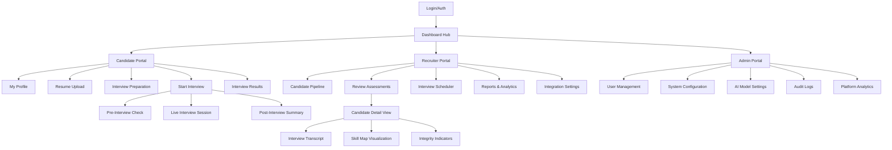
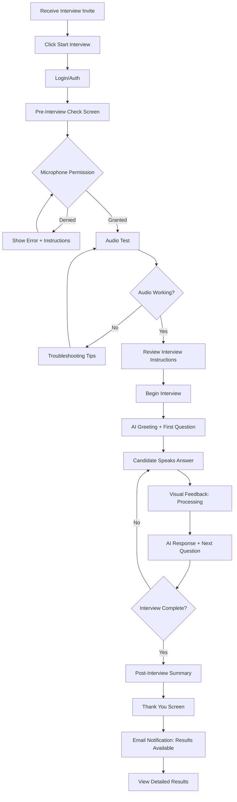
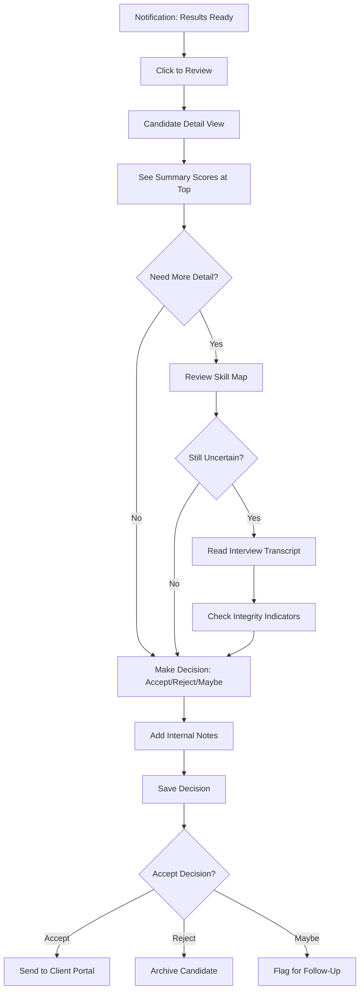
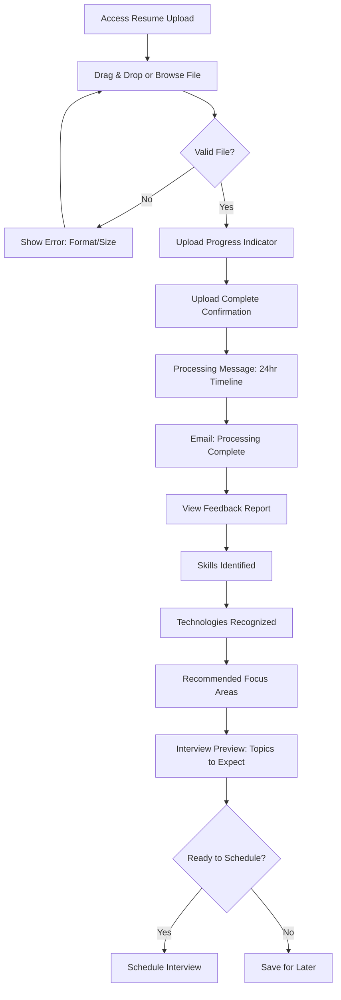
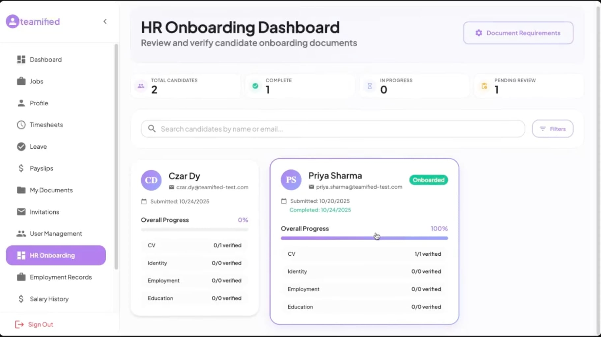

# Teamified Candidates Portal UI/UX Specification

## Introduction

This document defines the user experience goals, information architecture, user flows, and visual design specifications for Teamified Candidates Portal's user interface. It serves as the foundation for visual design and frontend development, ensuring a cohesive and user-centered experience.

### Overall UX Goals & Principles

#### Target User Personas

**1. Technical Candidate (Job Seeker)**
- Recent graduate to mid-level developer seeking employment through recruitment firms
- Anxious about AI-driven interviews but tech-savvy
- Needs clear guidance, reassurance, and a fair assessment experience
- Values: Transparency, feedback, ease of use

**2. Recruitment Consultant (Primary Platform User)**
- Works at recruitment firms processing 25-100+ technical interviews monthly
- Balances candidate experience with client requirements
- Needs efficiency, consistency, and confidence in results
- Values: Quick insights, reliable scoring, integration with existing tools

**3. Platform Administrator (System Manager)**
- Technical operations staff managing interview configurations and monitoring system health
- Needs oversight, control, and troubleshooting capabilities
- Values: Clear dashboards, detailed logs, system reliability

#### Usability Goals

- **Ease of learning:** Candidates can start their first AI interview within 2 minutes of account access with minimal instruction
- **Confidence building:** Progressive questioning reduces candidate anxiety while accurately mapping skills
- **Efficiency of use:** Recruiters can review candidate results and make decisions within 5 minutes per assessment
- **Error prevention:** Clear validation and confirmation for critical actions (interview start, assessment submission, candidate rejection)
- **Transparency:** Candidates understand what's being evaluated and why; recruiters understand AI scoring rationale

#### Design Principles

1. **Human-Centered AI** - Technology should feel helpful, not intimidating. Make AI interactions natural and conversational
2. **Progressive Disclosure** - Show only what's needed at each step. Don't overwhelm candidates or recruiters with information
3. **Immediate Feedback** - Every action gets clear, instant response. Candidates see progress; recruiters see real-time insights
4. **Accessible by Default** - Design for diverse abilities from the start, especially for speech interfaces with visual fallbacks
5. **Trust Through Transparency** - Be clear about how the AI works, what's being evaluated, and why decisions are made

## Information Architecture (IA)

### Site Map / Screen Inventory

### Navigation Structure

**Primary Navigation (Role-Based):**
- Top navigation bar adapts based on user role (Candidate/Recruiter/Admin)
- Persistent access to Dashboard, Profile, and Settings
- Notification center for interview invites, results ready, system alerts

**Candidate Navigation:**
- Dashboard → Resume Management → Interview Prep → Active Interviews → Past Results
- Breadcrumb navigation within interview flow to show progress

**Recruiter Navigation:**
- Dashboard → Candidate Pipeline → Schedule/Review → Analytics → Integrations
- Quick actions: "Schedule Interview," "Review Pending," "Export Report"

**Admin Navigation:**
- System Overview → User Management → Configuration → Monitoring → Logs
- Status indicators for system health visible in persistent header

**Breadcrumb Strategy:**
- Used in multi-step flows (interview process, candidate review)
- Format: `Home > Interviews > [Candidate Name] > Transcript`
- Clickable for easy navigation back to previous contexts

## User Flows

### Flow 1: Candidate - Complete AI Interview (Speech-Based)

**User Goal:** Successfully complete a speech-to-speech AI interview and receive assessment results

**Entry Points:** 
- Email invitation with "Start Interview" link
- Dashboard "Active Interview" card
- Direct link from recruiter

**Success Criteria:** 
- Interview completed without technical issues
- Candidate feels the experience was fair and clear
- Assessment results generated successfully

#### Flow Diagram

#### Edge Cases & Error Handling:

- **Microphone failure mid-interview:** Pause interview, show reconnection screen, allow resume from last question
- **Network interruption:** Auto-save progress every 3 questions, allow resume within 24 hours
- **Candidate wants to type instead of speak:** Provide "Switch to Text Mode" button for code examples only
- **AI response delays (>5 seconds):** Show "Thinking..." indicator, apologize for delay in next response
- **Candidate speaks over AI:** Detect interruption, pause AI speech, acknowledge and continue
- **Background noise interference:** Show real-time audio quality indicator, suggest quieter environment if persistent

**Notes:** This is the highest-stakes flow. Every friction point increases candidate anxiety and dropout risk. The pre-interview check is critical for catching technical issues before the assessment begins.

---

### Flow 2: Recruiter - Review Candidate Assessment

**User Goal:** Quickly evaluate a completed interview and make a decision

**Entry Points:**
- Dashboard "Pending Reviews" notification
- Candidate Pipeline "New Results" badge
- Email notification with direct link

**Success Criteria:**
- Recruiter can make confident decision within 5 minutes
- All relevant information is accessible without excessive clicking
- Decision and notes are saved to candidate record

#### Flow Diagram

#### Edge Cases & Error Handling:

- **Unclear AI scoring rationale:** Provide expandable "Why this score?" explanations for each competency
- **Multiple interviewers need to review:** Support comments/collaboration without overwriting decisions
- **Client-specific requirements not met:** Allow custom filtering/flagging based on client criteria
- **Recruiter wants to share specific moments:** Enable timestamp-based transcript sharing
- **Decision needs to be changed:** Allow status changes with audit trail and reason

**Notes:** Efficiency is critical here. The summary must surface actionable insights immediately. Progressive disclosure keeps the interface clean while allowing deep dives when needed.

---

### Flow 3: Candidate - Upload Resume & Receive Feedback

**User Goal:** Submit resume and understand preparation areas before interview

**Entry Points:**
- Account creation flow
- Dashboard "Upload Resume" prompt
- Pre-interview preparation checklist

**Success Criteria:**
- Resume successfully parsed
- Candidate receives actionable feedback within 24 hours
- Candidate feels prepared for interview focus areas

#### Flow Diagram

#### Edge Cases & Error Handling:

- **Resume format not parseable:** Provide manual skills input option as fallback
- **Skills mismatch with job role:** Warn candidate about potential gaps before interview
- **No technical experience detected:** Suggest entry-level interview track or request clarification
- **Multiple resumes uploaded:** Keep version history, clearly mark which is "active" for interviews
- **Candidate wants to update resume:** Allow re-upload, re-trigger parsing, note timeline impact

**Notes:** This flow builds candidate trust early. The 24-hour processing sets expectations and reduces anxiety about delays. Feedback must be constructive, not discouraging.

## Wireframes & Mockups

### Key Screen Layouts

#### Screen 1: Live Interview Session

**Purpose:** Primary candidate interaction screen for speech-based AI interviews. Must minimize anxiety while providing clear feedback about system state.

**Key Elements:**
- **AI Avatar/Visual Indicator** - Animated visual showing AI is listening or speaking (pulsing waveform or avatar)
- **Question Display** - Current question text displayed prominently for reference
- **Audio Visualizer** - Real-time waveform showing candidate's voice input (builds confidence that system is working)
- **Progress Indicator** - Non-intrusive indicator (e.g., "Question 5 of ~12") to manage expectations
- **Microphone Controls** - Large, accessible "Mute" button and audio level indicator
- **Text Mode Toggle** - Subtle "Switch to Text for Code" button for code examples
- **Emergency Options** - Minimized but accessible "Pause" and "End Interview" options

**Interaction Notes:**
- AI speaks → Avatar pulses + "Listening..." indicator turns off
- Candidate speaks → Waveform animates + subtle green glow around mic icon
- Processing answer → "Processing..." animation with estimated wait time if >2 seconds
- Question transitions should be smooth, not jarring
- All text should be readable even if candidate looks away briefly

**Layout Priority:**
1. Center: AI visual indicator + current question (80% of screen focus)
2. Bottom: Audio controls and visualizer (always visible, muscle memory location)
3. Top right: Progress + emergency controls (available but not distracting)

---

#### Screen 2: Candidate Results Dashboard

**Purpose:** Show candidates their assessment results in an encouraging, actionable way. Avoid feeling like a "report card."

**Key Elements:**
- **Overall Summary Card** - Friendly headline like "Great work! Here's what we learned about your skills"
- **Skill Strength Visualization** - Radial chart or bar graph showing proficiency areas (not just scores)
- **Growth Areas Section** - Reframe "weaknesses" as "Areas for Development" with resources
- **Interview Highlights** - 2-3 specific moments where candidate demonstrated strong skills (builds confidence)
- **Next Steps CTA** - Clear action like "Share with Recruiters" or "Prepare for Next Interview"
- **Detailed Transcript Access** - Link to full conversation (optional deep dive)

**Interaction Notes:**
- Entry animation reveals sections progressively (not all at once = overwhelming)
- Skill visualizations are interactive - hover/click for specific examples from interview
- Positive reinforcement before constructive feedback
- "Share Results" feature includes privacy controls (choose what recruiters see)

---

#### Screen 3: Recruiter - Candidate Detail View

**Purpose:** Enable rapid decision-making with progressive disclosure of detail. Summary first, depth on demand.

**Key Elements:**
- **Hero Section** - Candidate photo/avatar + name + overall score + quick decision buttons (Accept/Reject/Maybe)
- **Competency Summary Cards** - 4-6 key skills with traffic light indicators (red/yellow/green) and confidence scores
- **Integrity Dashboard** - Single "trust score" with expandable details (timing patterns, behavioral flags)
- **Skill Map Visualization** - Visual representation of skill boundaries and depth
- **Quick Facts Bar** - Years of experience, technologies, interview duration, completion date
- **Tabbed Deep Dive** - Tabs for "Transcript," "Skill Details," "Timeline," "Notes"
- **Action Panel** - Sticky right rail with decision buttons, note-taking area, and share options

**Interaction Notes:**
- Default view shows summary cards only - can make decision without scrolling
- Click any competency card → expands inline to show supporting evidence from transcript
- "Why this score?" tooltips on every metric
- Highlight feature lets recruiter mark specific transcript moments
- Auto-save notes as recruiter types
- Keyboard shortcuts for power users (A = Accept, R = Reject, etc.)

**Layout Priority:**
1. Top: Hero + Quick Decision (above the fold)
2. Middle: Competency cards in priority order (most relevant first)
3. Bottom: Tabbed detail (lazy-loaded to improve performance)
4. Right rail: Persistent action panel

---

#### Screen 4: Pre-Interview System Check

**Purpose:** Catch technical issues before the interview starts. Reduce mid-interview failures.

**Key Elements:**
- **Progress Checklist** - Visual checklist showing: Microphone Permission → Audio Test → Connection Test → Ready
- **Audio Test Interface** - "Speak now" prompt with real-time waveform visualization
- **Playback Confirmation** - "Listen to yourself" button to confirm audio quality
- **Troubleshooting Accordion** - Expandable help for common issues (permission denied, no audio detected, echo/feedback)
- **Browser Compatibility Warning** - Alert if using unsupported browser with "Switch Browser" recommendations
- **"Begin Interview" CTA** - Large, confident button that only enables when all checks pass
- **Support Contact** - Visible support chat/email option if candidate is stuck

**Interaction Notes:**
- Each checklist item turns green with checkmark when passed
- Failed checks show inline help immediately (no modal interruption)
- Audio test requires 3+ seconds of speech to pass (prevents false positives)
- "Skip Check" option only appears after 3 failed attempts (balance UX vs. technical requirements)
- Reassuring copy throughout: "This will only take a minute" + "We want to make sure everything works perfectly"

## Component Library / Design System

**Design System Approach:** Build a custom lightweight design system tailored for AI-driven assessment workflows. Focus on components that reduce cognitive load and provide clear system state feedback, particularly for speech-based interactions.

### Core Components

#### Button Component

**Purpose:** Primary interaction element for all CTAs and actions across the platform

**Variants:**
- **Primary** - Main actions (Start Interview, Submit, Accept Candidate)
- **Secondary** - Supporting actions (Cancel, Go Back, View Details)
- **Danger** - Destructive actions (End Interview, Reject Candidate, Delete)
- **Ghost** - Tertiary actions (Skip, Learn More, Expand)

**States:** Default, Hover, Active, Disabled, Loading

**Usage Guidelines:**
- Use Primary sparingly - only one per screen section to establish clear hierarchy
- Loading state shows spinner + dims button to 70% opacity
- Minimum touch target: 44x44px for accessibility
- Include icon + text for critical actions to reinforce meaning

---

#### Audio Visualizer Component

**Purpose:** Provide real-time visual feedback during speech input to build candidate confidence

**Variants:**
- **Listening Mode** - Animated waveform responding to voice amplitude
- **Processing Mode** - Pulsing animation indicating AI is analyzing
- **Speaking Mode** - AI response visualization

**States:** Idle, Active, Processing, Error

**Usage Guidelines:**
- Always visible during interview sessions
- Color-coded: Green (good audio), Yellow (weak signal), Red (no input detected)
- Minimum height: 60px for visibility
- Smooth transitions between states (300ms ease-in-out)

---

#### Progress Indicator Component

**Purpose:** Help users understand where they are in multi-step processes without creating anxiety

**Variants:**
- **Linear Progress Bar** - For defined steps (System Check: 1/3, 2/3, 3/3)
- **Circular Progress** - For indeterminate operations (Parsing resume...)
- **Step Indicator** - For interview flow with approximate count ("Question 5 of ~12")

**States:** In Progress, Completed, Current, Upcoming

**Usage Guidelines:**
- Use approximate counts in interviews ("~12 questions") to avoid rigidity
- Never show time remaining during interviews (increases anxiety)
- Completed steps show checkmark, not just color change
- Keep progress persistent but not dominant (top corner, small size)

---

#### Card Component

**Purpose:** Container for grouped information with consistent spacing and elevation

**Variants:**
- **Summary Card** - Candidate/skill overviews with key metrics
- **Interactive Card** - Clickable/expandable for progressive disclosure
- **Status Card** - Shows state with colored border (pending/complete/error)

**States:** Default, Hover, Selected, Expanded, Disabled

**Usage Guidelines:**
- Use subtle shadows (0-2px) to indicate elevation
- 16px padding for content, 24px for headers
- Expandable cards show chevron icon that rotates on expand
- Avoid nesting cards more than 2 levels deep

---

#### Notification/Alert Component

**Purpose:** Communicate system status, errors, and important messages

**Variants:**
- **Success** - Confirmations (Interview completed, Resume uploaded)
- **Warning** - Cautions (Weak audio detected, Session expiring soon)
- **Error** - Problems requiring action (Microphone access denied)
- **Info** - Helpful context (Processing may take 24 hours)

**States:** Visible, Dismissible, Persistent

**Usage Guidelines:**
- Position: Top-right for non-blocking, center modal for critical errors
- Auto-dismiss success after 5 seconds, keep errors until addressed
- Include action button for errors ("Fix Microphone", "Retry")
- Use icon + color + text (don't rely on color alone for accessibility)

---

#### Input Field Component

**Purpose:** Standard text input for forms and data entry

**Variants:**
- **Text Input** - Single line (name, email)
- **Text Area** - Multi-line (notes, comments)
- **File Upload** - Drag-drop zone (resume upload)
- **Search** - With search icon and clear button

**States:** Default, Focus, Filled, Error, Disabled

**Usage Guidelines:**
- Always include label (floating label on focus acceptable)
- Error messages appear below field in red with icon
- Focus states use 2px border (not just color change)
- Help text in 14px, positioned below field

---

#### Data Visualization Components

**Purpose:** Display assessment results and skill metrics in digestible formats

**Variants:**
- **Skill Map (Radar Chart)** - Multi-dimensional skill visualization
- **Competency Bars** - Horizontal bars showing proficiency levels
- **Score Gauge** - Circular gauge for overall assessment score
- **Timeline** - Interview progression and response patterns

**States:** Loading, Interactive (hover tooltips), Static (export view)

**Usage Guidelines:**
- Always include legend and axis labels
- Tooltips show exact values on hover
- Use consistent color coding (green=strong, yellow=moderate, red=needs work)
- Provide text alternative for screen readers

## Branding & Style Guide

**Design System:** Material-UI 3 Expressive Design with Teamified visual refinements - emphasizing bold simplicity, intuitive navigation, and accessibility-driven design with a professional and modern aesthetic.

**Reference Inspiration:** Clean, minimal HR dashboard aesthetic with subtle shadows, rounded cards, and clear status indicators.

### Visual Identity

**Brand Guidelines:** Material-UI 3 Expressive foundation with Teamified-specific refinements: generous spacing, rounded corners, layered shadows, dynamic typography, and smooth animations.

**Design Principles:**
- **Bold Simplicity:** Clean, uncluttered interfaces with purposeful elements
- **Intuitive Navigation:** Clear information hierarchy and logical user flows  
- **Accessibility-First:** WCAG 2.1 AA compliant design with inclusive practices
- **Expressive Design:** Dynamic typography, generous spacing, and thoughtful micro-interactions
- **Brand Consistency:** Unified visual language across all touchpoints
- **Professional Polish:** Subtle shadows, clear status indicators, and professional color palette

### Color Palette

#### Primary Brand Colors

| Color Type | Hex Code | Usage |
|------------|----------|-------|
| Primary Purple | #A16AE8 | Brand Purple - Main CTAs, key interactions, active navigation, brand presence |
| Primary Light | #E8E5F5 | Light Purple - Selected states, hover effects, subtle backgrounds |
| Primary Dark | #7B3FD6 | Dark Purple - Active states, emphasis, pressed buttons |

#### Success & Completion Colors

| Color Type | Hex Code | Usage |
|------------|----------|-------|
| Success Teal | #1DD1A1 | Onboarded status, completion indicators, success messages |
| Success Light | #D4F5EE | Completed status backgrounds, success highlights |
| Success Alt | #10B981 | Alternative success green for variety |

#### Semantic Colors

| Color Type | Hex Code | Usage |
|------------|----------|-------|
| Warning Orange | #FFA502 | Pending status, cautions, important notices |
| Error Red | #EF4444 | Errors, destructive actions, critical issues |
| Info Blue | #3B82F6 | Informational messages, neutral status |

#### Neutral/Gray Scale

| Color Type | Hex Code | Usage |
|------------|----------|-------|
| Dark Gray | #2C3E50 | Primary text, headings |
| Medium Gray | #7F8C8D | Secondary text, icons, inactive states |
| Light Gray | #F5F6F7 | Subtle backgrounds, disabled states |
| Border Gray | #E0E4E8 | Borders, dividers, card outlines |
| Background | #FAFBFC | Page backgrounds |
| White | #FFFFFF | Card backgrounds, surfaces |

### Typography

#### Font Families
- **Primary:** "Plus Jakarta Sans", "Inter", -apple-system, BlinkMacSystemFont, "Segoe UI", Roboto, sans-serif
- **Monospace:** 'Fira Code', 'Monaco', 'Courier New', monospace (for code examples)

#### Type Scale

| Element | Size | Weight | Line Height | Letter Spacing | Notes |
|---------|------|--------|-------------|----------------|-------|
| H1 (Page Title) | 56px | 700 | 1.1 | -0.02em | Main page headers |
| H2 (Section) | 44px | 600 | 1.2 | -0.01em | Major sections |
| H3 (Subsection) | 36px | 600 | 1.25 | -0.01em | Subsections |
| H4 (Card Title) | 30px | 600 | 1.3 | normal | Card headers |
| H5 | 24px | 600 | 1.35 | normal | Small titles |
| H6 (Label) | 20px | 600 | 1.4 | normal | Labels, small headers |
| Body Large | 18px | 500 | 1.5 | normal | Emphasized body text |
| Body1 | 16px | 400 | 1.6 | normal | Primary body text |
| Body2 | 14px | 400 | 1.5 | normal | Secondary body text |
| Caption | 12px | 500 | 1.4 | normal | Captions, metadata |
| Label/Overline | 11px | 500 | 1.4 | 0.5px | Uppercase labels, categories |

### Component Styling

#### Border Radius Scale
- **Small (badges, pills, status):** 16px (full pill shape)
- **Medium (buttons, inputs):** 8px
- **Large (cards):** 12px
- **Extra Large (modals, dialogs):** 16-20px
- **Circle (avatars):** 50%

#### Shadows & Elevation
- **Card Default:** `0 2px 8px rgba(0, 0, 0, 0.04)`
- **Card Hover:** `0 4px 16px rgba(0, 0, 0, 0.08)`
- **Level 1 (Subtle):** `0 4px 6px -1px rgba(0, 0, 0, 0.1), 0 2px 4px -1px rgba(0, 0, 0, 0.06)`
- **Level 2 (Medium):** `0 10px 15px -3px rgba(0, 0, 0, 0.1), 0 4px 6px -2px rgba(0, 0, 0, 0.05)`
- **Level 3 (Strong):** `0 20px 25px -5px rgba(0, 0, 0, 0.1), 0 10px 10px -5px rgba(0, 0, 0, 0.04)`
- **Dialog:** `0 25px 50px -12px rgba(0, 0, 0, 0.25)`

#### Component Specifications

**Buttons:**
- **Height:** 44px (standard), 36px (compact)
- **Padding:** 12px 24px (standard)
- **Border Radius:** 8px
- **Font:** 14px, Medium (500)
- **Primary:** Purple background (#A16AE8), white text
- **Secondary:** Transparent with border (#E0E4E8), dark gray text
- **Hover:** Darken primary by 10%, light gray background for secondary

**Cards:**
- **Background:** White (#FFFFFF)
- **Border:** 1px solid #E0E4E8
- **Border Radius:** 12px
- **Padding:** 24px
- **Shadow:** `0 2px 8px rgba(0, 0, 0, 0.04)`
- **Selected State:** 2px purple border (#A16AE8)

**Avatars:**
- **Sizes:** 56px (large), 40px (medium), 32px (small)
- **Background:** Purple (#A16AE8) or gradient
- **Text:** White, centered initials
- **Border Radius:** 50% (circle)

**Status Badges:**
- **Height:** 24px
- **Padding:** 4px 12px
- **Border Radius:** 16px (pill)
- **Font:** 12px, Medium (500)
- **Success:** Teal background (#1DD1A1), white text
- **Pending:** Orange background (#FFA502), white text
- **Info:** Light teal background (#D4F5EE), teal text (#1DD1A1)

**Progress Bars:**
- **Height:** 8px
- **Background:** Light gray (#E0E4E8)
- **Fill:** Purple (#A16AE8)
- **Border Radius:** 4px
- **Label:** 14px, Medium, purple

**Input Fields:**
- **Height:** 44px
- **Border:** 1px solid #E0E4E8
- **Border Radius:** 8px
- **Padding:** 12px 16px
- **Font:** 14px, Regular
- **Placeholder:** Medium gray (#A0A7B0)
- **Focus:** 2px purple border (#A16AE8)

### Spacing & Layout

**Grid System:** 12-column grid with responsive breakpoints

**Spacing Scale:** Based on 8px baseline
- **XXS:** 4px (tight spacing)
- **XS:** 8px (small spacing)
- **S:** 12px (compact spacing)
- **M:** 16px (medium spacing)
- **L:** 24px (large spacing)
- **XL:** 32px (extra large spacing)
- **XXL:** 48px (section spacing)
- **XXXL:** 64px (page spacing)

**Layout Spacing:**
- **Page Margins:** 24px (mobile), 32px (tablet), 48px (desktop)
- **Sidebar Width:** 256px (fixed on desktop)
- **Card Padding:** 24px
- **Form Field Spacing:** 16px vertical
- **Button Padding:** 12px vertical, 24px horizontal
- **Navigation Item Padding:** 12px 16px
- **Navigation Item Margin:** 4px between items

### Iconography

**Icon Library:** Material-UI Icons or Outlined icons with 2px stroke width

**Usage Guidelines:**
- **Sizes:** 16px (small), 20px (navigation), 24px (standard), 32px (large)
- **Style:** Outlined, minimal, 2px stroke
- **Color:** Inherit from parent or medium gray (#7F8C8D)
- **Grid:** 24×24px base grid
- **Corner Radius:** 2px for icon shapes

**Common Icons:**
- Dashboard: Grid
- Interviews: Microphone
- Candidates: Users
- Profile: User
- Documents: Folder
- Settings: Gear
- Success: Check circle

## Accessibility Requirements

### Component Styling

**Border Radius:**
- **Base Components:** 16px (buttons, text fields)
- **Cards:** 20px
- **Dialogs:** 24px
- **Chips:** 12px

**Shadows & Elevation:**
- **Level 1:** `0 4px 6px -1px rgba(0, 0, 0, 0.1), 0 2px 4px -1px rgba(0, 0, 0, 0.06)`
- **Level 2:** `0 10px 15px -3px rgba(0, 0, 0, 0.1), 0 4px 6px -2px rgba(0, 0, 0, 0.05)`
- **Level 3:** `0 20px 25px -5px rgba(0, 0, 0, 0.1), 0 10px 10px -5px rgba(0, 0, 0, 0.04)`
- **Dialog:** `0 25px 50px -12px rgba(0, 0, 0, 0.25)`

### Spacing & Layout

**Grid System:** 12-column grid with responsive breakpoints

**Spacing Scale:** Based on 8px baseline
- **xs:** 4px (tight spacing)
- **sm:** 8px (small spacing)
- **md:** 16px (medium spacing)
- **lg:** 24px (large spacing)
- **xl:** 32px (extra large spacing)
- **xxl:** 48px (section spacing)
- **xxxl:** 64px (page spacing)

**Layout Spacing:**
- **Page Margins:** 24px (mobile), 32px (tablet), 48px (desktop)
- **Card Padding:** 24px
- **Form Field Spacing:** 16px vertical
- **Button Padding:** 14px vertical, 28px horizontal

### Iconography

**Icon Library:** Material-UI Icons with consistent 2px stroke width

**Usage Guidelines:**
- 24x24px default size for UI icons
- 16x16px for inline icons within text
- Use outlined style for inactive states, filled for active states
- Maintain visual consistency with rounded, friendly aesthetic

## Accessibility Requirements

### Compliance Target

**Standard:** WCAG 2.1 Level AA compliance

### Key Requirements

**Visual:**
- **Color contrast ratios:** Minimum 4.5:1 for normal text, 3:1 for large text (18px+ or 14px+ bold)
- **Focus indicators:** Visible 2px outline on all interactive elements, minimum 3:1 contrast with background
- **Text sizing:** Support browser text resize up to 200% without loss of functionality
- **Color independence:** Never use color alone to convey information (pair with icons, text, or patterns)

**Interaction:**
- **Keyboard navigation:** All interactive elements accessible via Tab, Enter, Space, Arrow keys
- **Skip links:** "Skip to main content" link at top of each page
- **Focus management:** Logical tab order, focus trapped in modals, returned to trigger after close
- **Touch targets:** Minimum 44x44px for all interactive elements

**Content:**
- **Alternative text:** Descriptive alt text for all meaningful images and icons
- **Heading structure:** Proper semantic hierarchy (H1 → H2 → H3, no skipping levels)
- **Form labels:** Every input has associated label (visible or aria-label)
- **ARIA attributes:** Use landmarks, live regions for dynamic content

**Speech-Specific Accessibility:**
- **Text alternatives:** Always provide text input option alongside speech input
- **Visual feedback:** Audio state indicators don't rely solely on color
- **Transcripts available:** Interview conversations provided as text for deaf/hard-of-hearing candidates
- **Pause/resume controls:** Large, clearly labeled controls for managing audio playback

### Testing Strategy

**Automated Testing:**
- Integrate axe-core or similar tool into CI/CD pipeline
- Run on every build, fail on WCAG AA violations

**Manual Testing:**
- Keyboard-only navigation testing on all critical paths
- Screen reader testing (NVDA, VoiceOver) monthly
- Color blindness simulation using tools like ColorOracle
- Magnification testing at 200% zoom on all pages

**User Testing:**
- Include users with disabilities in usability testing (minimum 20% of test participants)
- Specific testing with deaf/hard-of-hearing users for interview flow

## Responsiveness Strategy

### Breakpoints

| Breakpoint | Min Width | Max Width | Target Devices |
|------------|-----------|-----------|----------------|
| Mobile | 320px | 767px | Smartphones, small tablets in portrait |
| Tablet | 768px | 1023px | Tablets, small laptops |
| Desktop | 1024px | 1439px | Laptops, desktop monitors |
| Wide | 1440px | - | Large monitors, ultrawide displays |

### Adaptation Patterns

**Layout Changes:**
- **Mobile:** Single column layout, full-width cards, collapsible navigation drawer
- **Tablet:** Two-column grid for cards, side navigation becomes collapsible
- **Desktop:** Multi-column layouts, persistent side navigation, optimized for mouse interaction
- **Wide:** Additional whitespace, max content width to prevent line length issues

**Navigation Changes:**
- **Mobile:** Hamburger menu with slide-out drawer, bottom tab bar for main actions
- **Tablet:** Condensed top navigation with icons + labels, some secondary items in overflow menu
- **Desktop:** Full horizontal navigation with all items visible, dropdown menus for sub-items
- **Wide:** Same as desktop but with increased spacing between navigation items

**Content Priority:**
- **Mobile:** Hide secondary information, focus on primary actions and content
- **Tablet:** Show more context, progressive disclosure for detailed information
- **Desktop:** Full information available, multiple panes for efficient workflows
- **Wide:** Leverage extra space for contextual information and tool panels

**Interaction Changes:**
- **Mobile:** Touch-optimized (44px+ targets), swipe gestures, pull-to-refresh
- **Tablet:** Hybrid touch/cursor support, medium-sized targets (40px+)
- **Desktop:** Mouse-optimized hover states, keyboard shortcuts, right-click menus
- **Wide:** Enhanced keyboard navigation, multiple simultaneous workflows

### Critical Responsive Considerations

**Interview Flow:**
- **Mobile:** Portrait orientation preferred, larger microphone button, simplified progress indicator
- **Tablet:** Can support landscape for split-screen (question + controls)
- **Desktop:** Optimal experience with large question display and comprehensive controls

**Recruiter Dashboard:**
- **Mobile:** Card-based candidate list, single candidate view, minimal data
- **Tablet:** Grid view with candidate cards, modal detail views
- **Desktop:** Table view with inline expansion, multi-pane layouts for efficiency

**Data Visualizations:**
- **Mobile:** Simplified charts, horizontal scrolling for detailed data
- **Tablet:** Responsive charts with touch interaction
- **Desktop:** Full interactive visualizations with hover details and drill-down capabilities

## Animation & Micro-interactions

### Motion Principles

**Purposeful Motion:** Every animation serves a specific function - providing feedback, guiding attention, or indicating system state. Avoid decorative animations that don't enhance usability.

**Performance-Conscious:** All animations maintain 60fps performance, with fallbacks for devices that struggle. Respect users' "prefers-reduced-motion" accessibility settings.

**Contextual Timing:** Animation duration matches the perceived weight and importance of the interaction. Critical feedback (errors) appears quickly, while non-urgent transitions can be more leisurely.

### Key Animations

- **Button Press:** Subtle scale down (0.95x) on press + slight shadow reduction (Duration: 150ms, Easing: ease-out)
- **Button Hover:** Background darken 10%, shadow increase (Duration: 150ms, Easing: cubic-bezier(0.4, 0.0, 0.2, 1))
- **Card Hover:** Shadow elevation increase, subtle lift effect (Duration: 250ms, Easing: cubic-bezier(0.4, 0.0, 0.2, 1))
- **Navigation Active:** Purple background fade-in with smooth color transition (Duration: 250ms, Easing: cubic-bezier(0.0, 0.0, 0.2, 1))
- **Page Transitions:** Slide transitions between major sections, fade for modals (Duration: 300ms, Easing: cubic-bezier(0.4, 0.0, 0.2, 1))
- **Audio Visualizer:** Real-time waveform animation responding to input amplitude (Duration: Continuous, Easing: linear)
- **Progress Updates:** Smooth progress bar fills with subtle elastic bounce at completion (Duration: 400ms, Easing: ease-out)
- **Card Expansion:** Height expansion with content fade-in staggered 100ms after container (Duration: 250ms, Easing: cubic-bezier(0.4, 0.0, 0.2, 1))
- **Loading States:** Gentle pulse on elements being updated, skeleton loading for content areas (Duration: 1500ms loop, Easing: ease-in-out)
- **Error States:** Gentle shake animation for form errors, red glow for critical alerts (Duration: 300ms, Easing: ease-out)
- **Success Confirmations:** Green/teal checkmark with scale and fade animation (Duration: 500ms, Easing: cubic-bezier(0.0, 0.0, 0.2, 1))
- **Status Badge Transitions:** Smooth color transitions when status changes (Duration: 250ms, Easing: cubic-bezier(0.4, 0.0, 0.2, 1))

### Timing Functions
- **Standard (General):** `cubic-bezier(0.4, 0.0, 0.2, 1)` - 150-250ms
- **Enter (Appear):** `cubic-bezier(0.0, 0.0, 0.2, 1)` - 250ms
- **Exit (Disappear):** `cubic-bezier(0.4, 0.0, 1, 1)` - 200ms
- **Fast (Hover):** 150ms
- **Medium (Transitions):** 250ms
- **Slow (Modals, Drawers):** 350ms

## Performance Considerations

### Performance Goals

- **Page Load:** Initial page load under 3 seconds on 3G connection
- **Interaction Response:** UI response within 100ms for all user interactions
- **Animation FPS:** Maintain 60fps for all animations and transitions

### Design Strategies

**Lazy Loading:** Load components and images only when needed, prioritize above-the-fold content first.

**Progressive Enhancement:** Provide basic functionality immediately, enhance with advanced features as resources load.

**Optimized Assets:** Use WebP images with JPEG fallbacks, SVG icons, optimize bundle sizes through code splitting.

**Perceived Performance:** Use skeleton screens during loading, provide immediate feedback for user actions, implement optimistic UI updates.

## Next Steps

### Immediate Actions

1. **Stakeholder Review:** Share this specification with product team, engineering leads, and key stakeholders for feedback
2. **Technical Feasibility Review:** Engineering team validates technical approaches and identifies potential challenges
3. **Style Guide Completion:** Finalize branding and color palette based on provided style references
4. **Component Prioritization:** Identify which components to build first based on critical user flows
5. **Accessibility Audit Setup:** Establish automated testing tools and manual testing processes

### Design Handoff Checklist

- [x] All user flows documented
- [x] Component inventory complete
- [x] Accessibility requirements defined
- [x] Responsive strategy clear
- [x] Brand guidelines incorporated (Material-UI 3 Expressive Design)
- [x] Performance goals established
- [x] Animation specifications defined

### Change Log

| Date | Version | Description | Author |
|------|---------|-------------|--------|
| 2025-10-28 | 1.0 | Initial front-end specification creation | Sally (UX Expert) |

---

## Summary

This UI/UX specification provides a comprehensive foundation for building the Teamified Candidates Portal's frontend. The specification prioritizes:

- **Anxiety reduction** for candidates through clear feedback and progressive disclosure
- **Efficiency optimization** for recruiters via summary-first information architecture  
- **Accessibility-first design** ensuring the platform works for all users
- **Speech-interface optimization** with unique components for audio feedback
- **Scalable component system** supporting rapid feature development
- **Professional polish** with Material-UI 3 Expressive Design refined by clean, modern HR dashboard aesthetics

### Design System Highlights

The specification integrates Material-UI 3 Expressive Design with Teamified-specific refinements:

**Visual Style:**
- Brand Purple (#A16AE8) with success Teal (#1DD1A1) for positive completion states
- Plus Jakarta Sans typography with comprehensive type scale (56px headlines to 11px labels)
- 8px-based spacing system with generous breathing room
- Subtle shadows (2px-8px) for professional depth without heaviness
- Rounded corners (8-16px) for modern, friendly appearance

**Component Excellence:**
- Status badges with clear color-coding (purple, teal, orange)
- Clean card design with 1px borders and subtle shadows
- Polished button states with smooth hover transitions
- Professional progress bars and data visualizations
- Outlined icons with 2px stroke for consistency

**Interaction Polish:**
- Smooth animations (150-350ms) using Material cubic-bezier easing
- Clear hover and focus states for all interactive elements
- Professional transitions that feel responsive but not rushed
- Accessibility-first with proper contrast, keyboard support, and ARIA

This specification is ready for technical implementation and will create a polished, professional candidate assessment platform that balances AI innovation with user-centered design principles.

